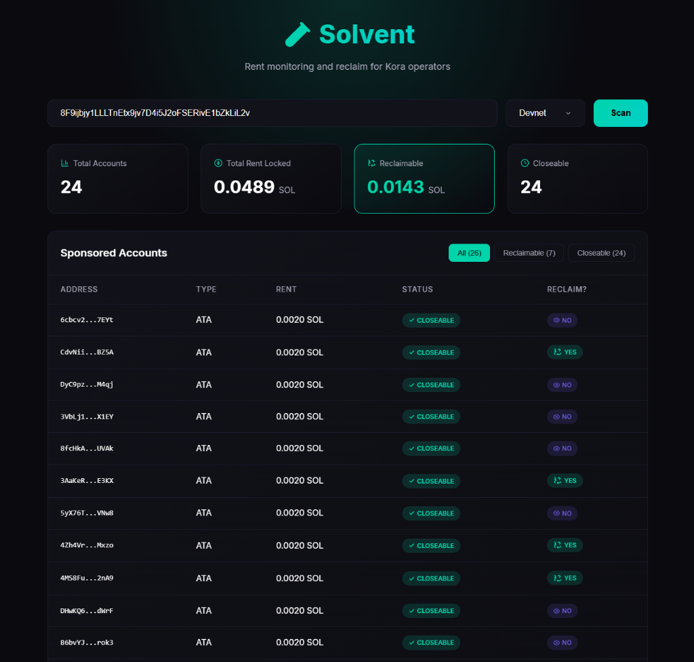
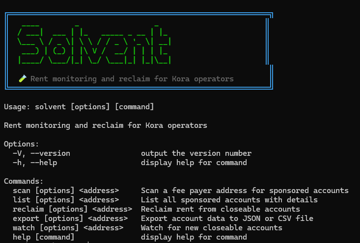
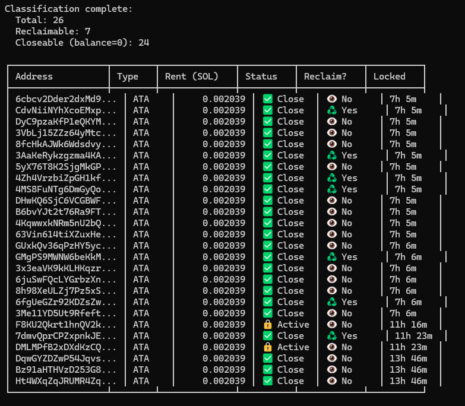

# 🧪 Solvent

> **Rent monitoring and reclaim tool for Kora operators on Solana**

[](https://kora.network)
[](https://solana.com)
[](https://typescriptlang.org)

---

## 🎯 What is Solvent?

**Solvent** helps Kora operators monitor and reclaim rent from sponsored accounts on Solana.

When Kora sponsors transactions that create accounts (like ATAs), rent SOL gets locked in those accounts. Solvent:
- **Scans** your fee payer's transaction history
- **Identifies** accounts created by your sponsorship
- **Classifies** accounts as RECLAIMABLE or MONITOR-ONLY
- **Reclaims** rent from closeable accounts (when you have authority)
- **Alerts** you about accounts requiring manual action

---

## ✨ Features

| Feature | CLI | Dashboard | Telegram |
|---------|-----|-----------|----------|
| Scan fee payer history | ✅ | ✅ | ✅ |
| List sponsored accounts | ✅ | ✅ | ✅ |
| Calculate rent statistics | ✅ | ✅ | ✅ |
| Classify accounts | ✅ | ✅ | ✅ |
| Filter by status | ✅ | ✅ | — |
| Auto-reclaim rent | ✅ | 🔜 | — |
| Dry-run mode | ✅ | — | — |
| Export reports (JSON/CSV) | ✅ | ✅ | — |
| Live watch mode | ✅ | — | — |
| Scheduled alerts | — | — | ✅ |
| Address tracking | — | — | ✅ |

---

## 🚀 Quick Start

### Prerequisites
- Node.js 18+
- npm 9+

### Installation

```bash
# Clone and install
git clone https://github.com/AngryPacifist/solvent
cd solvent
npm install

# Build
npm run build

# Link CLI globally (optional - enables `solvent` command)
npm link -w packages/cli
```

### CLI Usage

```bash
# Scan a fee payer address
solvent scan <FEE_PAYER_ADDRESS> --network devnet

# List all sponsored accounts
solvent list <FEE_PAYER_ADDRESS> --network devnet

# List only reclaimable accounts
solvent list <FEE_PAYER_ADDRESS> --filter reclaimable

# Export to JSON or CSV
solvent export <FEE_PAYER_ADDRESS> --format json --output report
solvent export <FEE_PAYER_ADDRESS> --format csv --output report

# Live watch mode (poll for new closeable accounts)
solvent watch <FEE_PAYER_ADDRESS> --interval 60

# Reclaim rent (dry run)
solvent reclaim <FEE_PAYER_ADDRESS> --dry-run

# Reclaim rent (live)
solvent reclaim <FEE_PAYER_ADDRESS> --keypair ~/.config/solana/id.json
```

> **Note:** If you haven't run `npm link`, use `npx solvent` or `node packages/cli/dist/index.js` instead.

### Dashboard

```bash
# Start the dashboard
cd packages/dashboard
npm run dev

# Open http://localhost:5173
```

### Mainnet Usage

> ⚠️ The public Solana mainnet RPC has rate limits that may block heavy scanning.

For production mainnet use, we recommend a dedicated RPC provider:
- [Helius](https://helius.dev) (free tier available)
- [QuickNode](https://quicknode.com)
- [Triton](https://triton.one)

Devnet works without restrictions for testing.

### Transaction Scan Limits

By default, Solvent scans the **last 100 transactions** to balance speed vs completeness.

For fee payers with extensive history, increase the limit:

```bash
# Scan more transactions (up to 1000 supported)
solvent scan <address> --limit 500

# Dashboard uses fixed limit of 100 for responsiveness
```

> **Note:** Higher limits = more RPC calls = slower scan. For operators with thousands of sponsorships, consider running CLI with a dedicated RPC.

---

## 📊 How It Works

### Account Classification

Solvent classifies sponsored accounts into two categories:

| Classification | Close Authority | Can Auto-Reclaim? |
|----------------|-----------------|-------------------|
| **RECLAIMABLE** | = Fee Payer | ✅ Yes |
| **MONITOR-ONLY** | = User/Other | ❌ No (alert only) |

### Rent Reclaim Flow

```
1. SCAN → Get fee payer's transaction history
2. PARSE → Extract account creation events
3. CLASSIFY → Check close_authority on each account
4. ANALYZE → Calculate rent stats, find closeable (balance=0)
5. ACTION → Auto-close RECLAIMABLE or alert for MONITOR-ONLY
```

---

## 🏗️ Architecture

```
solvent/
├── packages/
│   ├── core/           # Shared library (@angrypacifist/solvent-core)
│   ├── cli/            # Command-line interface
│   ├── dashboard/      # Web interface (React + Vite)
│   └── telegram/       # Telegram bot (Vercel + grammY)
├── docs/               # Documentation
└── package.json        # Monorepo root
```

---

## 🔬 Technical Deep Dive

### The Rent Problem

When Kora sponsors a transaction that creates an ATA:
- Kora's fee payer pays ~0.002 SOL for rent
- The ATA owner is the user (not Kora)
- The `close_authority` defaults to the owner

**Result**: Kora cannot close user-owned accounts → rent is "lost"

### The Solution

Solvent discovered that if `close_authority` is set to the fee payer during account creation, Kora CAN reclaim rent!

```typescript
// Standard ATA creation - Kora CANNOT reclaim
createAssociatedTokenAccountInstruction(feePayer, ata, user, mint);

// With close_authority set - Kora CAN reclaim
createAssociatedTokenAccountInstruction(feePayer, ata, user, mint);
setAuthorityInstruction(ata, user, AuthorityType.CloseAccount, feePayer);
```

We verified this approach successfully reclaims 0.002 SOL per ATA!

---

## 📈 Screenshots

### Dashboard


### CLI


### List Command


---

## 📊 Example Output

### CLI Scan
```
🧪 SOLVENT - Rent Scanner

Fee Payer: 8F9ijbjy1LLLTnEtx9jv7D4i5J2oFSERivE1bZkLiL2v
Network: devnet
Limit: 100 transactions

Classifying 26 accounts...
  Classified 10/26 (4 reclaimable)
  Classified 20/26 (6 reclaimable)

Classification complete:
  Total: 26
  Reclaimable: 7
  Closeable (balance=0): 24

╔══════════════════════════════════════════════════════════════╗
║                    SOLVENT RENT REPORT                       ║
╠══════════════════════════════════════════════════════════════╣
║  📊 Total Accounts:                   24                     ║
║  💰 Total Rent Locked:          0.048943 SOL                 ║
╠══════════════════════════════════════════════════════════════╣
║  ✅ Reclaimable Accounts:              7                     ║
║  💎 Reclaimable Rent:           0.014275 SOL                 ║
╠══════════════════════════════════════════════════════════════╣
║  👁️  Monitor-Only Rent:          0.034668 SOL                 ║
║  ⏳ Closeable (balance=0):            24                     ║
╚══════════════════════════════════════════════════════════════╝

💡 Tip: Run 'solvent reclaim <address>' to reclaim 0.014275 SOL
ℹ️  Note: 17 closeable accounts require owner action (monitor-only)

╔════════════════════════════════════════════════════════════════╗
║  💎 ROI CALCULATOR                                             ║
╠════════════════════════════════════════════════════════════════╣
║  If close_authority was set to fee payer during creation:      ║
║  → You could reclaim:   0.034668 SOL (17 accounts)             ║
║                                                                ║
║  💡 Set close_authority = fee payer when sponsoring ATAs       ║
╚════════════════════════════════════════════════════════════════╝
```

---

## 🛡️ Safety Features

- **Dry Run Mode**: Preview actions without executing
- **Confirmation Prompts**: Require explicit confirmation for reclaim
- **Balance Checks**: Never close accounts with non-zero balance
- **Authority Checks**: Verify close_authority before attempting
- **Full Audit Trail**: Log all actions with tx signatures

---

## 🔧 Development

```bash
# Install dependencies
npm install

# Build all packages
npm run build

# Run CLI in dev mode
npm run cli -- scan <ADDRESS>

# Run dashboard
npm run dashboard
```

---

## 📚 Resources

- [Full Documentation](./docs/) - Detailed guides and API reference
- [Telegram Bot](https://t.me/solvent_rent_bot) - @solvent_rent_bot
- [npm Package](https://www.npmjs.com/package/@angrypacifist/solvent-core) - @angrypacifist/solvent-core
- [Kora Documentation](https://kora.network/docs)
- [Solana Token Program](https://spl.solana.com/token)

---

## 👤 Author

**Outis** - Built for the Superteam Nigeria Kora Bounty

---

## 📄 License

MIT License - see [LICENSE](LICENSE) for details
